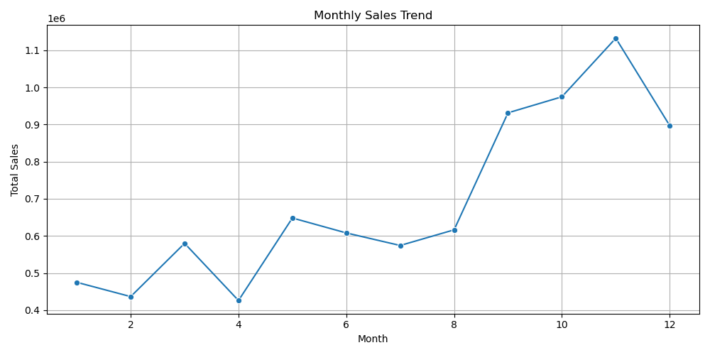

# 🛒 Retail Data Analysis – Task 1 (Internship Project)

This project is part of my data analysis internship at **CODTECH IT SOLUTIONS PVT. LTD.** It involves analyzing a retail transaction dataset using Python (Pandas) to clean data, perform transformations, and extract key business insights.

---

## 📁 Dataset

- File: `Retail.csv`
- Source: Converted from Excel (`Retail.xlsx`)
- Columns include:
  - InvoiceNo
  - StockCode
  - Description
  - Quantity
  - InvoiceDate
  - UnitPrice
  - CustomerID
  - Country

---

## 🔧 Tools Used

- Python
- Pandas
- Matplotlib / Seaborn
- Jupyter Notebook / VS Code

---

## 🧹 Data Cleaning

- Removed rows with missing `CustomerID`
- Converted `InvoiceDate` to datetime format
- Created new column `TotalAmount = Quantity × UnitPrice`

---

## 📊 Insights Generated

1. **Top 5 Countries by Total Sales**
2. **Monthly Sales Trend** (with visualization)
3. **Top 5 Most Sold Products**



---

## 🚀 How to Run

```bash
python task1_pandas_analysis.py
